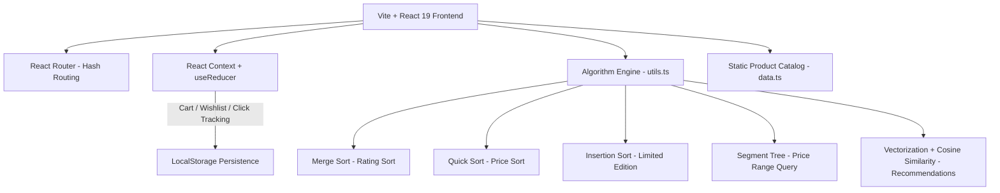

# VARIABLES
### A Quiet-Luxury E-Commerce Experience, Engineered on Classic Algorithms

*A full-stack React + TypeScript + Vite storefront that pairs a premium fashion-retail UI with hand-built sorting, searching, and recommendation algorithms — a showcase of both product design and core computer science fundamentals.*

[](https://react.dev)
[](https://www.typescriptlang.org)
[](https://vitejs.dev)
[](https://reactrouter.com)
[](https://tailwindcss.com)

---

## 📖 Project Overview

Most storefront demos stop at "add to cart." **VariableS** goes further: every sort, filter, and recommendation on the site is powered by an algorithm implemented from scratch rather than a library call — turning a fashion e-commerce UI into a working demonstration of **merge sort, quick sort, insertion sort, segment trees, and vector-similarity search**.

The result is a fully responsive quiet-luxury storefront — maroon-and-gold palette, Playfair Display serif type, animated hero carousel — with real shopping mechanics (cart, wishlist, persisted state) layered on top of a genuine DSA engine.

---

## ✨ Key Features

### 1. Full Product Catalog & Navigation
- Men's, Women's, Kids', and Accessories collections, broken into granular subcategories (shirts, trousers, hoodies, dresses, footwear, jewellery, and more).
- Category → subcategory → product drill-down with breadcrumb navigation throughout.

### 2. Search, Filter & Range Query Engine
- Full-text search from the navbar routes into a dedicated **Filter** page.
- Category, subcategory, and **price-range filtering powered by a custom-built Segment Tree**, giving O(log n) range queries instead of a linear scan.
- Sort by relevance, price, or rating — sorting itself is done with a hand-written **Quick Sort**.

### 3. Limited Edition Archive
- A curated 10-piece capsule collection, independently sortable by price/rating/newest using a from-scratch **Insertion Sort** (ideal for its small, near-sorted dataset).

### 4. Personalized Recommendation Engine
- Builds a "user DNA" feature vector from wishlist and cart activity (category, material, design signals).
- Ranks the entire catalog by **cosine similarity** against that vector.
- New users with no activity fall back to a **Merge Sort**-ranked "Top Rated" list — no cold-start dead end.

### 5. Outfit Architect
- One-click outfit generator that randomly assembles a coordinated look (top, bottom, footwear, accessory) for Men's, Women's, or Kids' modes.
- "Shuffle" to regenerate instantly, or add the entire generated outfit to the bag in one tap.

### 6. Cart, Wishlist & Persistence
- Slide-out cart drawer with live quantity controls and running total.
- Heart-to-wishlist on every product card.
- Cart, wishlist, and category-click analytics persist to `localStorage` via a centralized reducer, and rehydrate automatically on reload.

### 7. Premium, Animated UI
- Custom maroon (`#5b0f0f`) and gold (`#e2b07e`) theme with Playfair Display + Inter typography.
- Auto-advancing hero carousel, scroll-reveal animations, and a fully responsive layout down to mobile.

---

## 🛠️ Technical Architecture



---

## 🚀 Getting Started

### Prerequisites
- [Node.js](https://nodejs.org) (v18 or higher recommended)

### Installation

1. **Clone or unzip the project, then move into it:**
   ```bash
   cd variables-fashion-store
   ```

2. **Install dependencies:**
   ```bash
   npm install
   ```

3. **(Optional) Configure environment variables:**
   Set your key in `.env.local` if you plan to wire up AI features later:
   ```env
   GEMINI_API_KEY="your-gemini-api-key-here"
   ```

4. **Run the developer build:**
   ```bash
   npm run dev
   ```
   Open your browser and navigate to the local URL Vite prints (typically `http://localhost:5173`).

5. **Build for production:**
   ```bash
   npm run build
   npm run preview
   ```

---

## 📁 Project Structure

- `App.tsx` — Route definitions, global layout, footer.
- `AppContext.tsx` — Global state provider (React Context) for cart, wishlist, and UI flags.
- `reducer.ts` — All cart/wishlist/persistence state transitions.
- `utils.ts` — The algorithm engine: merge sort, quick sort, insertion sort, segment tree, cosine-similarity recommender.
- `data.ts` — Raw product catalog and the logic that flattens it into a searchable `PRODUCTS` array.
- `types.ts` — Shared TypeScript interfaces (`Product`, `CartItem`, `StoreState`, `StoreAction`).
- `components/Navbar.tsx` — Top navigation, search bar, cart/wishlist entry points.
- `components/CartDrawer.tsx` — Slide-out cart panel with quantity controls and totals.
- `components/ProductCard.tsx` — Reusable product tile with wishlist toggle and add-to-cart.
- `pages/Home.tsx` — Hero carousel, featured sections, customer reviews.
- `pages/Categories.tsx` / `Subcategories.tsx` / `Products.tsx` — Catalog drill-down flow.
- `pages/Filter.tsx` — Search results, category/price filtering, and sorting (segment tree + quick sort).
- `pages/LimitedEdition.tsx` — Capsule collection with insertion-sort-based sorting.
- `pages/Recommendations.tsx` — Cosine-similarity personalized picks with merge-sort fallback.
- `pages/OutfitGenerator.tsx` — Randomized outfit builder ("Outfit Architect").
- `pages/Wishlist.tsx` / `Profile.tsx` — Saved items and account summary.

---

## 🗺️ Routes

| Path | Page |
|---|---|
| `/` | Home |
| `/categories` | Category browsing |
| `/subcategories?cat=...` | Subcategories within a category |
| `/products?cat=...&sub=...` | Product listing |
| `/filter?q=...` | Search & filter results |
| `/limited` | Limited Edition archive |
| `/recommendations` | Personalized recommendations |
| `/outfit-generator` | Outfit Architect |
| `/wishlist` | Saved items |
| `/profile` | Account summary |

---

**Built as a full-stack academic showcase — combining e-commerce UX with hand-implemented sorting, search, and recommendation algorithms.**
