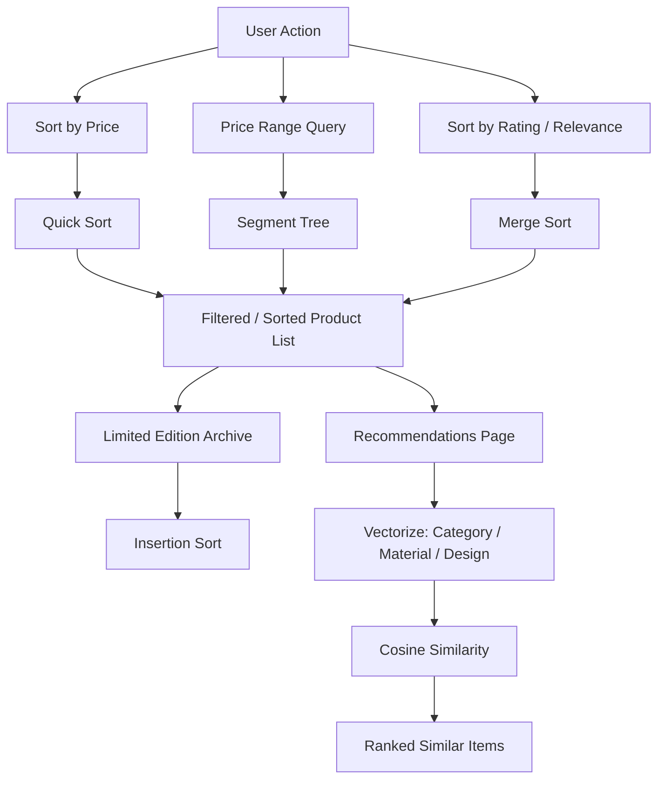
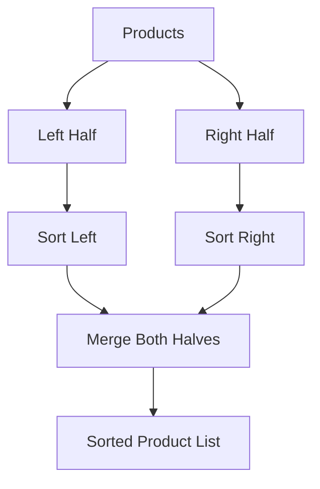
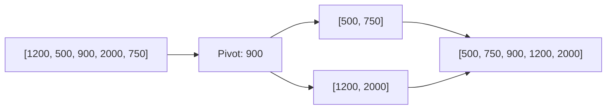
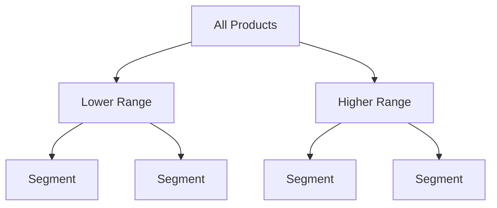
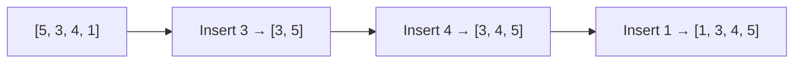
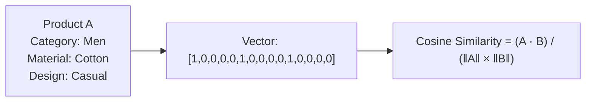
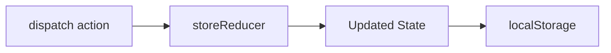
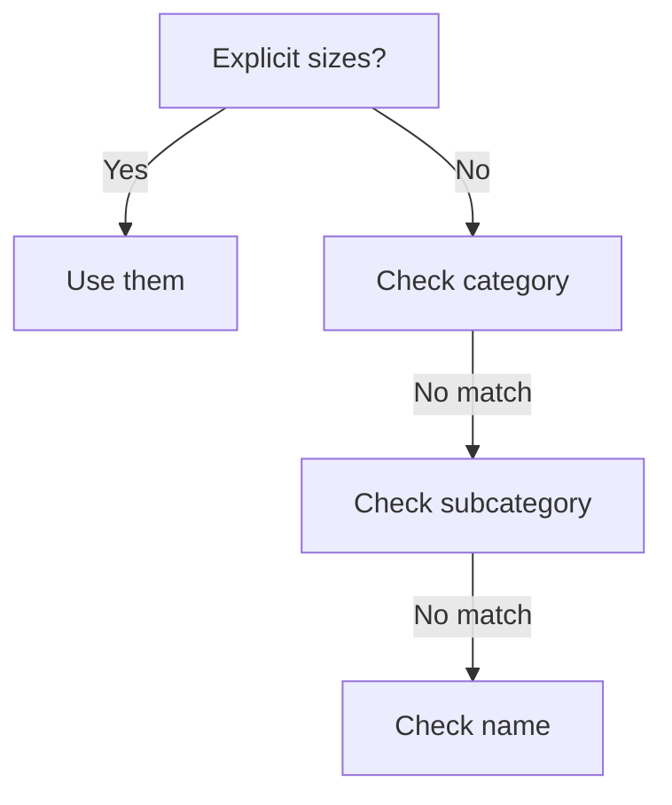

<div align="center">

# VariableS

### A Fashion Storefront Where Every Sort, Filter, and Recommendation Is a Deliberate Algorithm Choice

<p>


</p>

</div>

---

## 🎯 Purpose

VariableS is a DAA (Design and Analysis of Algorithms) project built to show how algorithm choice should change with the problem, inside a real, working application rather than isolated exercises.

Every data-shaping operation in the storefront — sorting, price-range filtering, and recommendations — is routed through the algorithm that actually fits the access pattern: **Merge Sort, Quick Sort, Insertion Sort, a Segment Tree, and Cosine Similarity.**

## 🧭 What It Does

A full storefront UI — categories, subcategories, product browsing, cart, wishlist, an outfit generator, and a limited-edition archive — built in React + TypeScript:

- **Sorts** — rating/relevance via Merge Sort, price via Quick Sort, the small limited-edition archive via Insertion Sort.
- **Filters** — price-range queries answered by a custom Segment Tree built over the catalog, so a range lookup doesn't mean scanning every product.
- **Recommends** — products vectorized by category/material/design and compared with Cosine Similarity, so "similar products" means similar in the attributes that matter.
- **Sizes** — dynamically resolved per product through a priority chain (explicit sizes → category → subcategory → name), so no SKU needs hand-entered size data.
- **Persists** — cart, wishlist, and category-click history survive a refresh via `localStorage`, run through a single Context + Reducer state layer.

## 💡 Key Design Choices

- ✅ **Algorithm picked per access pattern** — a one-time numeric sort, a repeated range query, and a similarity comparison are three different problems and get three different tools.
- ✅ **Built, not imported** — every sort and the segment tree are hand-implemented in `utils.ts` rather than wrapping `.sort()`, so the mechanics are visible and explainable.
- ✅ **One state layer, one source of truth** — cart, wishlist, and interaction tracking all flow through a single reducer.
- ✅ **Size logic degrades gracefully** — the fallback chain infers a sensible size set so the catalog stays easy to extend.

## ✨ Features

<table>
<tr>
<td width="33%" valign="top">

### 🛍️ Discover
- Browse by category → subcategory
- Keyword search across name, category, subcategory
- Product detail with customization options
- Outfit generator for complementary pairings

</td>
<td width="33%" valign="top">

### 🔍 Filter & Sort
- Segment-tree-backed min/max price range
- Quick Sort for price (low↔high)
- Merge Sort for rating / relevance
- Category + subcategory + keyword filters, combinable

</td>
<td width="33%" valign="top">

### 🧠 Recommend
- Cosine-similarity product matching
- Category / material / design feature vectors
- Category-click tracking feeds relevance
- Insertion-sorted limited-edition archive

</td>
</tr>
</table>

**Also included:** cart drawer with per-size line items and quantity controls, wishlist, a `localStorage`-backed persistence layer, and a concierge section for shipping/returns/sizing/tracking info.

## 🏗️ Architecture

**Where each algorithm lives in the request path:**


```mermaid
flowchart TD
    A[User Action] --> B[Sort by Price]
    A --> C[Price Range Query]
    A --> D[Sort by Rating / Relevance]

    B --> E[Quick Sort]
    C --> F[Segment Tree]
    D --> G[Merge Sort]

    E --> H[Filtered / Sorted Product List]
    F --> H
    G --> H

    H --> I[Limited Edition Archive]
    H --> J[Recommendations Page]

    I --> K[Insertion Sort]
    J --> L[Vectorize: Category / Material / Design]
    L --> M[Cosine Similarity]
    M --> N[Ranked Similar Items]
```

**State flow — every cart / wishlist / tracking change:**


```mermaid
flowchart LR
    A[Component Action] --> B[dispatch action]
    B --> C[storeReducer]
    C --> D[AppContext State]
    D --> E[localStorage Sync]
```

## 🧮 Algorithms Used

### 1. Merge Sort — Rating & Relevance Sort
**Where:** `Filter.tsx`, `Recommendations.tsx`


```mermaid
flowchart TD
    A[Products] --> B[Left Half]
    A --> C[Right Half]
    B --> D[Sort Left]
    C --> E[Sort Right]
    D --> F[Merge Both Halves]
    E --> F
    F --> G[Sorted Product List]
```

| Case | Time |
|---|---|
| Best/Avg/Worst | O(n log n) |

**Why:** Always O(n log n), no bad worst case, and it's stable — equal ratings stay in order.

---

### 2. Quick Sort — Price Sort
**Where:** `Filter.tsx`


```mermaid
flowchart LR
    A["[1200, 500, 900, 2000, 750]"] --> B[Pivot: 900]
    B --> C["[500, 750]"]
    B --> D["[1200, 2000]"]
    C --> E["[500, 750, 900, 1200, 2000]"]
    D --> E
```

| Case | Time |
|---|---|
| Best/Avg | O(n log n) |
| Worst | O(n²) |

**Why:** Prices are numbers in memory — Quick Sort sorts them in place, no extra array needed, and is fast in practice.

---

### 3. Segment Tree — Price Range Filter
**Where:** `Filter.tsx` (`ProductSegmentTree` in `utils.ts`)


```mermaid
flowchart TD
    A[All Products] --> B[Lower Range]
    A --> C[Higher Range]
    B --> D[Segment]
    B --> E[Segment]
    C --> F[Segment]
    C --> G[Segment]
```

**Why:** For a query like ₹1,000–₹5,000, whole out-of-range segments get skipped instead of every product being checked one by one.

---

### 4. Insertion Sort — Limited Edition Archive
**Where:** `LimitedEdition.tsx`


```mermaid
flowchart LR
    A["[5, 3, 4, 1]"] --> B["Insert 3 → [3, 5]"]
    B --> C["Insert 4 → [3, 4, 5]"]
    C --> D["Insert 1 → [1, 3, 4, 5]"]
```

| Case | Time |
|---|---|
| Best | O(n) |
| Avg/Worst | O(n²) |

**Why:** The archive is tiny compared to the full catalog — simple and fast enough, no need for a heavier sort.

---

### 5. Cosine Similarity — Recommendations
**Where:** `Recommendations.tsx` (`vectorizeProduct`, `cosineSimilarity` in `utils.ts`)


```mermaid
flowchart LR
    A["Product A
    Category: Men
    Material: Cotton
    Design: Casual"] --> V["Vector: [1,0,0,0,0,1,0,0,0,0,1,0,0,0,0]"]
    V --> S["Cosine Similarity = (A · B) / (‖A‖ × ‖B‖)"]
```

**Why:** Each product becomes a feature vector, and cosine similarity checks how closely two vectors point in the same direction — a simple, explainable way to find "similar" products without training an ML model.

---

### 6. Reducer Pattern — Cart, Wishlist & State
**Where:** `reducer.ts`, `AppContext.tsx`


```mermaid
flowchart LR
    A[dispatch action] --> B[storeReducer]
    B --> C[Updated State]
    C --> D[localStorage]
```

**Why:** Every cart/wishlist change goes through one function with named actions (`ADD_TO_CART`, `TOGGLE_WISHLIST`, etc.) instead of state being changed all over the place.

---

### 7. Priority-Fallback — Product Sizing
**Where:** `getAvailableSizes()` in `utils.ts`


```mermaid
flowchart TD
    A[Explicit sizes?] -->|Yes| B[Use them]
    A -->|No| C[Check category]
    C -->|No match| D[Check subcategory]
    D -->|No match| E[Check name]
```

**Why:** New products don't need sizes typed in manually — the app figures out a sensible size set on its own.

## 🛠️ Tech Stack

| Layer | Technology |
|---|---|
| **UI** | React 19.2, TypeScript, React Router 7 |
| **State** | React Context API + `useReducer` |
| **Build** | Vite 6 |
| **Persistence** | Browser `localStorage` (no backend) |
| **Icons** | lucide-react |

## 📂 Project Structure

```
variables-fashion-store/
│
├── components/
│   ├── Navbar.tsx
│   ├── CartDrawer.tsx
│   └── ProductCard.tsx
│
├── pages/
│   ├── Home.tsx
│   ├── Categories.tsx
│   ├── Subcategories.tsx
│   ├── Products.tsx
│   ├── Filter.tsx              → price-range (Segment Tree) + sort (Quick/Merge Sort)
│   ├── Recommendations.tsx     → vectorize + Cosine Similarity
│   ├── Wishlist.tsx
│   ├── Profile.tsx
│   ├── OutfitGenerator.tsx
│   ├── LimitedEdition.tsx      → Insertion Sort
│   └── Concierge.tsx           → shipping / returns / sizing / tracking
│
├── App.tsx                     → routes + layout
├── AppContext.tsx               → Context provider + localStorage sync
├── reducer.ts                   → all state-update logic, one switch statement
├── utils.ts                     → every algorithm implementation lives here
├── data.ts                      → product catalog + category data
├── types.ts                     → Product / CartItem / StoreState / StoreAction
├── constants.ts
├── imageRegistry.ts
├── heroData.ts
├── reviewsData.ts
├── index.tsx / index.css
├── vite.config.ts
└── package.json
```

## 🚀 Getting Started

### Clone & Install
```bash
git clone https://github.com/YOUR-USERNAME/variables-fashion-store.git
cd variables-fashion-store
npm install
```

### Run Locally
```bash
npm run dev
```
The app will be available at the local URL Vite prints in the terminal.

### Production Build
```bash
npm run build      # build
npm run preview    # preview the build locally
```

## 🎯 What This Project Demonstrates

- Divide-and-conquer sorting (Merge Sort, Quick Sort)
- Small-input/near-sorted sorting (Insertion Sort)
- Tree-based range queries (Segment Tree)
- Feature vectorization + Cosine Similarity for content-based recommendations
- Reducer-centralized state management over Context API
- Priority-fallback logic for flexible, low-maintenance data (product sizing)
- Client-side persistence without a backend

## 🔮 Future Improvements

- Backend + database-backed product storage instead of a static catalog
- Real authentication and order history
- Collaborative filtering alongside the existing content-based recommendations
- Admin dashboard for catalog management
- Unit tests around the algorithm implementations in `utils.ts`

---

<div align="center">
<b>Built as a DAA project to demonstrate how merge sort, quick sort, insertion sort, segment trees & cosine similarity can be applied to solve real-world problems.</b>
<br><br>
</div>

<div align="center">

**⭐ If you found this project useful, consider giving it a star!**

</div>
